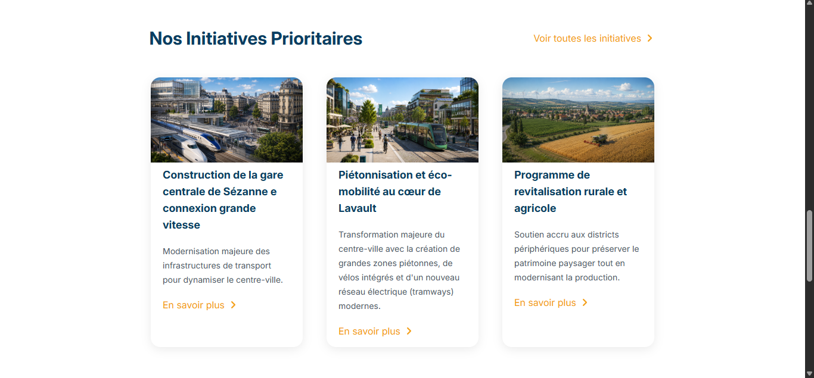
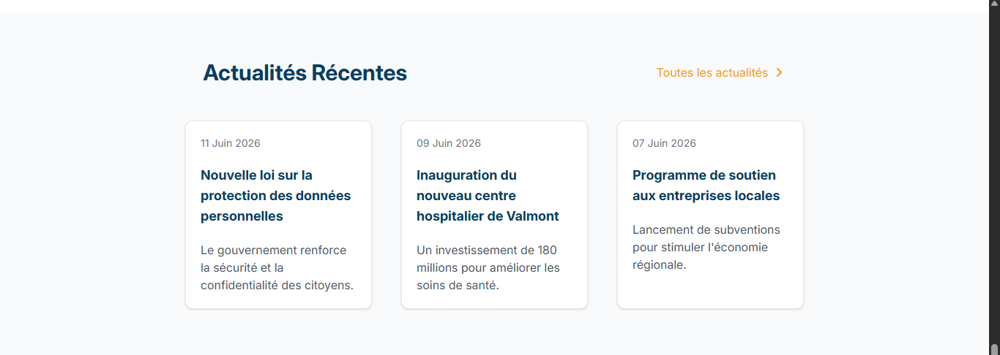
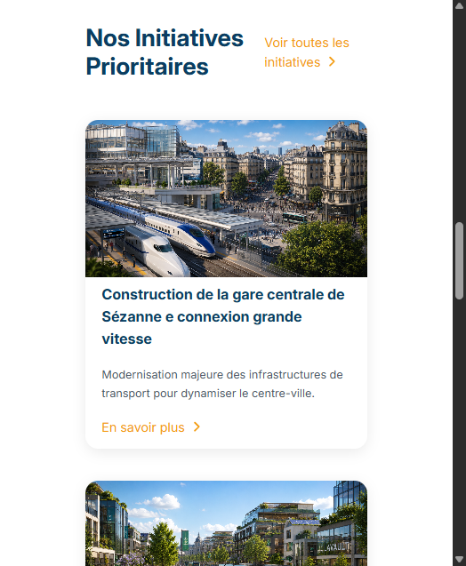
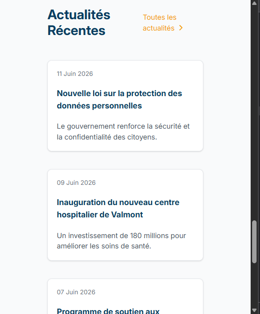

# 🇫🇷 République de Lavault

Portal governamental fictício desenvolvido para praticar **HTML, CSS e JavaScript**, com foco em interfaces modernas, responsividade e arquitetura de componentes.

---

## 🌍 Sobre o projeto

**République de Lavault** é uma nação fictícia inspirada em países francófonos europeus, criada como parte de um universo próprio desenvolvido no jogo *Cities: Skylines*.

Este projeto simula um portal oficial do governo, reunindo serviços públicos, notícias institucionais e informações sobre as províncias do país em uma interface moderna e intuitiva.

### O portal inclui:

* 🏛️ Página inicial institucional
* 📂 Menu desktop com dropdown
* 📱 Menu mobile com navegação em submenus
* 🔍 Barra de pesquisa
* 🖼️ Hero section com banner principal
* 📰 Área de notícias recentes
* 🚆 Seção de iniciativas prioritárias
* 🧩 Grid de serviços públicos
* 📐 Layout totalmente responsivo

---

## 🛠️ Tecnologias utilizadas

* HTML5
* CSS3
* JavaScript (Vanilla)
* Flexbox
* CSS Grid
* Media Queries
* Font Awesome

---

## 🎯 Objetivos de aprendizado

Este projeto foi desenvolvido para praticar:

* Estruturação semântica com HTML
* Criação de layouts modernos
* Responsividade para desktop e mobile
* Componentização visual
* Manipulação do DOM com JavaScript
* Menus interativos (dropdown e hamburger)
* Organização escalável de CSS

---

## 📸 Capturas de tela

### Menu e Hero


### Menu mobile


### Seção de serviços e notícias

<div align="center">
  
  
</div>

<div align="center">
  
  
</div>

---

## 🚀 Como executar

1. Clone o repositório:

```bash
git clone https://github.com/Mnaces31/Republique_de_Lavault.git
```

2. Entre na pasta do projeto

3. Abra o arquivo:

```text
index.html
```

---

## 📌 Status do projeto

🚧 Em desenvolvimento

Próximas implementações:

* Páginas de serviço
* Sistema de busca
* Novas páginas institucionais
* Melhorias de acessibilidade

---

## 👨‍💻 Autor

**Mateus Manacés**

Desenvolvedor em formação com foco em desenvolvimento back-end e banco de dados.

---

## ✨ Sobre Lavault

Lavault é um universo fictício próprio, construído com forte inspiração em urbanismo europeu, administração pública digital e planejamento territorial moderno.

O portal busca representar como seria a presença digital oficial dessa nação, combinando estética institucional, usabilidade e design contemporâneo.
